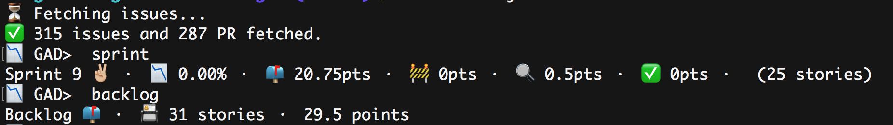

# 📉 Github Agile Dashboard

## Installation

    npm install -g @elao/github-agile-dashboard

## Configuration

### GitHub authentication

As [recommended by GitHub](https://github.com/blog/180-local-github-config), Gad relies on `github.user` and `github.token` variables in your git config to authenticate you on GitHub API. Follow these three steps and you're good to go:

1. Set up your GitHub username in your git config:

    `git config --global github.user "Tom32i"`

2. [Generate](https://github.com/settings/tokens) a [GitHub personal access token](https://help.github.com/articles/creating-a-personal-access-token-for-the-command-line/) with the __following access rights__: `repo` and `user`.

3. Set up your GitHub token in your git config:

    `git config --global github.token MyGitHubPersonalAccessToken`

## Usage

### Configure your agile project on GitHub

1. Create a milestone "Backlog" (or whatever name) with no due date : it will be your backlog.
2. Create a milestone per Sprint with a due date.
3. Create two labels "Ready to review" and "In Progress".
4. Create issues in milestone "Backlog".
5. Add an estimation `[x]` in the issue title, for example: "Add a user login [3]".
6. Create Pull Request in sprint milestone with tag "Ready to review" or "In Progress".

### Commands

In your projet repository, just enter `gad [command] (options)`.

| Command | Description | Options |
|---|---|---|
| __sprint__ | Show the state of the current sprint | __sprint__ `-s=-1` Show the previous sprint |
| __sprints__ | Show the state of all sprints | __limit__ `-l=2` limit the number of sprint to display |
| __backlog__ | Show the state of the backlog | |
| __review__ | Display PullRequest that are awaiting your review | |
| __changelog__ | Generate a markdown changelog of the current sprint | __all__ `--all` include open issues in the changelog. __sprint__ `-s=-2` Show the changelog from two sprints ago |
| __estimate__ | Show stories that are missing estimation | |
| __status__ | Show the status of the repository | |
| __help__ | Show list of commands | |
| __exit__ | Quit the dashboard | |

### Options

You can manually specify any of the options on the fly:

    gad -o [organisation|owner] -r [repo] -u [username] -p [password|token]

E.g.: `gad -o Elao -r symfony-standard -u Tom32i -p MyGitHubPersonalAccessToken`

#### Cache

For performance purpose, Gad keeps a little cache file for each repository.

By default, it's located in `~/.gad/cache` but you can specify a different path with the `cacheDir` option:

    gad -c ./cache

# Contributing

## Installation

    git clone git@github.com:Elao/github-agile-dashboard.git
    cd github-agile-dashboard
    npm install

## Usage

    node gad.js -o [organisation|owner] -r [repo] -u [username] -p [password|token]

