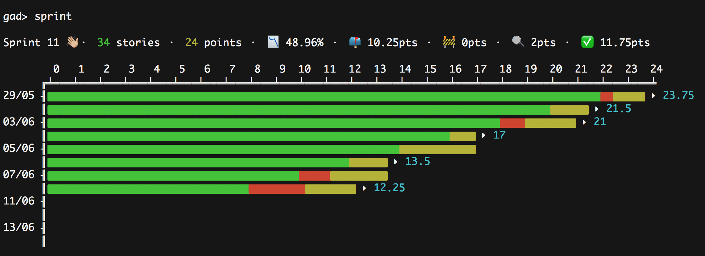

# 📉 Github Agile Dashboard

## Installation

    npm install -g git+https://github.com/Elao/github-agile-dashboard.git

## Configuration

### GitHub Access Token

[Generate](https://github.com/settings/tokens) a [GitHub personal access token](https://help.github.com/articles/creating-a-personal-access-token-for-the-command-line/) with the following access rights: `repo` and `user`.
Edit your bash file with `sudo vim ~/.bashrc` and export the generated token as below:

    export GITHUB_PERSONAL_TOKEN=MyGitHubPersonalAccessToken

### GitHub username

If not already done, set up your GitHub username in your git config:

    git config --global github.user "Tom32i"

## Usage

In your projet repository, just enter `gad`.

### Commands

| Command | Description |
|---|---|
| __sprint__ | Show the state of the current sprint |
| __sprints__ | Show the state of all sprints |
| __backlog__ | Show the state of the backlog |
| __status__ | Show the status of the repository |
| __help__ | Show list of commands |
| __exit__ | Quit the dashboard |

### Options

You can manually specify any of the options on the fly:

    gad -o [organisation|owner] -r [repo] -u [username] -p [password|token]

E.g.: `gad -o Elao -r symfony-standard -u Tom32i -p MyGitHubPersonalAccessToken`

# Contributing

## Installation

    git clone git@github.com:Elao/github-agile-dashboard.git
    cd github-agile-dashboard
    npm install

## Usage

    npm start -o [organisation|owner] -r [repo] -u [username] -p [password|token]

